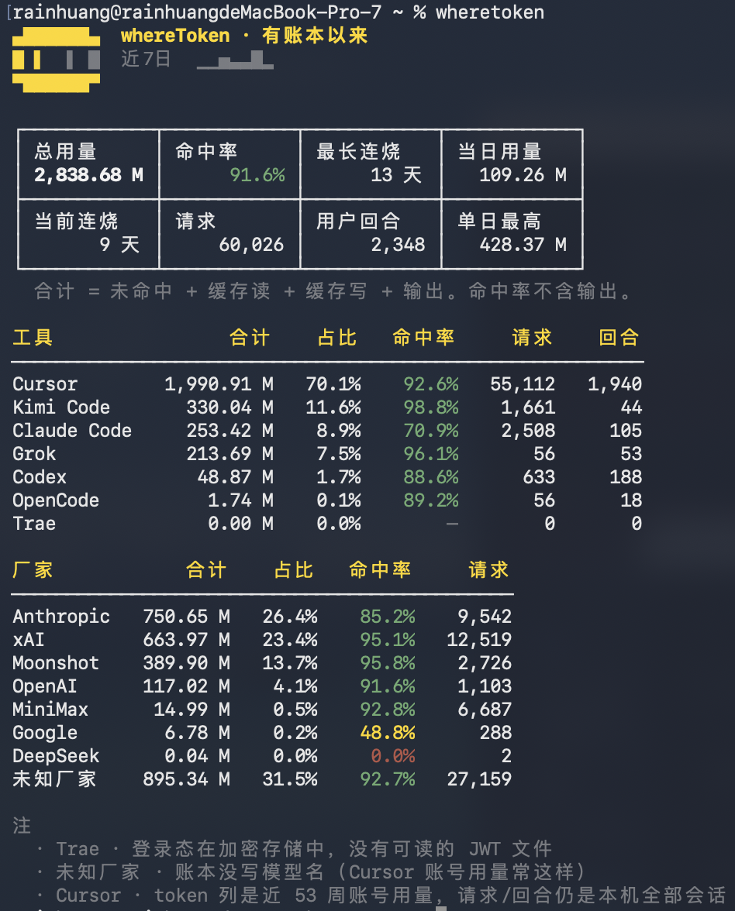
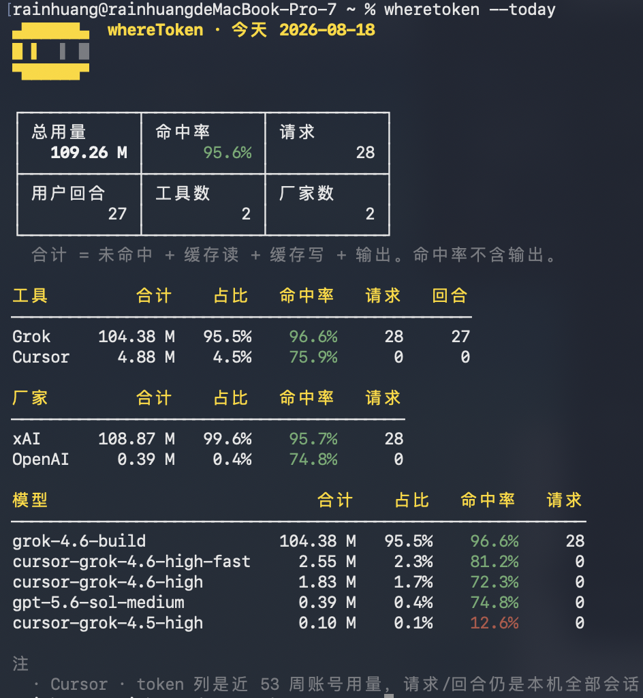
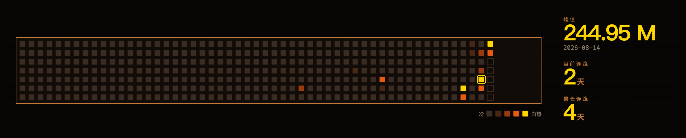
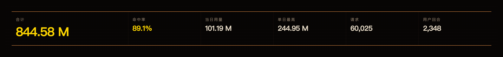
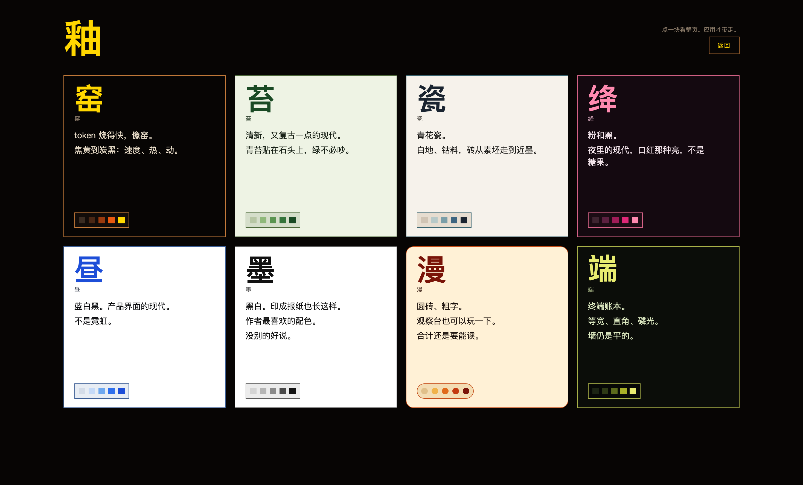

<p align="center">
  
</p>

<h1 align="center">whereToken</h1>

<p align="center">
  See where your <b>local</b> coding-agent tokens went.<br>
  One command. A character table. A kiln dashboard if you want one.
</p>

<p align="center">
  <a href="./README.md"><b>English</b></a> ·
  <a href="./README.zh-CN.md">简体中文</a>
</p>

<p align="center">
  <a href="https://github.com/rainhuang0220/whereToken/releases"></a>
  <a href="https://github.com/rainhuang0220/whereToken/actions/workflows/ci.yml"></a>
  <a href="./LICENSE"></a>
  <a href="https://go.dev/"></a>
  
</p>

<p align="center">
  
</p>

> **v0.3.0 is an Alpha.** Run it on your own ledgers. [Open an issue](https://github.com/rainhuang0220/whereToken/issues) when something is wrong, and send pull requests. The table and dashboard speak Chinese today.

No cloud account. No USD prices. No telemetry. Claude Code, Cursor, Kimi, Grok, Codex, OpenCode, and Trae each keep a corner of the story — whereToken adds the pile together from files already on this machine.

**Tool ≠ vendor.** Claude Code running MiniMax is still tool Claude Code, vendor MiniMax.

## Install

```bash
brew tap rainhuang0220/wheretoken
brew install wheretoken
```

```bash
curl -fsSL https://raw.githubusercontent.com/rainhuang0220/whereToken/main/scripts/install.sh | bash
```

```powershell
irm https://raw.githubusercontent.com/rainhuang0220/whereToken/main/scripts/install.ps1 | iex
```

The curl / irm script prints the path it installed (usually `~/.local/bin/wheretoken`). Run that line. This shell will not see `wheretoken` until you open a new terminal. Archives are SHA-256 checked against `checksums.txt`.

```bash
go install github.com/rainhuang0220/whereToken/cmd/wheretoken@latest   # Go 1.25+
brew install --HEAD ./Formula/wheretoken.rb                            # from a clone, needs Go
```

The kiln dashboard is in **GitHub Release** binaries and `brew tap rainhuang0220/wheretoken`. `go install` and `brew --HEAD` embed a short HTML stub — from a clone, `cd web && npm run build`, then `WHERETOKEN_WEB=web/dist wheretoken serve`.

The `npm/` wrapper is **not on the npm registry** yet.

## Usage

```
$ wheretoken --help
```

```
wheretoken — local coding-agent token usage, as a character table.

USAGE
  wheretoken [flags]
  wheretoken [flags] serve [--port 8787]
  wheretoken [flags] scan          observatory JSON (not schema 1; no --today/--tool)
  wheretoken [flags] sources
  wheretoken [flags] completion bash|zsh|fish|powershell

FLAGS
  -h, --help           this text
  -V, --version        print version
  --today              only today in the local timezone
  --tool NAME          slice by tool (claude, kimi, grok, codex, opencode, cursor, trae)
  --vendor NAME        slice by vendor (anthropic, moonshot, minimax, xai, …)
  --model NAME         slice by model id (user turns are per-tool, so that KPI is —)
  --claude --kimi --grok --codex --opencode --cursor --trae
  --json               JSON on stdout (schema 1)
  --offline            local ledgers only; skip Cursor/Trae APIs
  --quiet              no scan-progress lines on stderr

EXAMPLES
  wheretoken
  wheretoken --today
  wheretoken --cursor
  wheretoken --today --kimi
  wheretoken --vendor=xai
  wheretoken --model=k3
  wheretoken --tool=claude --json
  wheretoken --offline --quiet
  wheretoken serve
```

`wheretoken` with no flags is everything since records began, in **M** (million tokens). `--today` is just today — same table, local timezone, plus the model list. `--cursor` / `--claude` / `--kimi` / `--grok` / `--codex` / `--opencode` / `--trae` slice by tool. `wheretoken serve` opens the kiln at [http://127.0.0.1:8787](http://127.0.0.1:8787) — **刷新** rescans, reloading the tab does not.

<p align="center">
  
</p>

Hit rate is cache-read on the input side only. A signed-out Cursor is a footnote, not a fake `0.00 M` that looks unused.

## Kiln

```bash
wheretoken serve
```

53-week wall, peak / streaks, then the same numbers as a readout. Eight glazes under **主题**. The dashboard does not load Google Fonts or any other third-party asset.

<p align="center">
  
</p>

<p align="center">
  
</p>

<p align="center">
  
</p>

## What it reads

Default scan only covers tools that already have a ledger on disk. macOS and Linux are first-class; Windows uses `%APPDATA%` the same way.

| Source | Tokens without signing in? |
|--------|----------------------------|
| Claude Code | Yes — `~/.claude/projects/**/*.jsonl` |
| Kimi Code | Yes — `~/.kimi-code/` |
| Grok CLI | Yes — `~/.grok/sessions/**/updates.jsonl` |
| Codex | Yes — `${CODEX_HOME:-~/.codex}/sessions/**/rollout-*.jsonl` |
| OpenCode | Yes — `$XDG_DATA_HOME/opencode` or `~/.local/share/opencode` |
| Cursor | Requests / turns from local bubbles. **Token columns need the app signed in.** |
| Trae / Trae CN / TRAE SOLO | **Yes, sign-in.** Encrypted `storage.json` is reported, not decrypted. |

Field mapping: [`docs/data-sources.md`](docs/data-sources.md). Not in this release: Windsurf, Copilot, Cline, Lingma, and similar, until there is a clear local token ledger.

`wheretoken scan --json` is the same payload the dashboard **刷新** uses. It is **not** schema 1, and it does not take `--today` / `--tool`.

<details>
<summary>More flags, env, exit codes</summary>

```bash
wheretoken --ascii             # old Windows consoles
wheretoken --width 40          # ranking drops 回合/请求 before names become C...
wheretoken --json              # schema 1 — docs/cli-json.schema.json
wheretoken sources
wheretoken completion zsh      # also bash, fish, powershell
```

Checked-in scripts: [`completions/`](completions/). Manual page: [`docs/wheretoken.1`](docs/wheretoken.1).

```bash
wheretoken completion zsh > ~/.zfunc/_wheretoken   # then add ~/.zfunc to fpath
```

`--json` (schema 1) includes `period`, `total`, `total_m`, `hit_rate`, `requests`, `user_turns`, `tools`, `vendors`, `notes`. `--today` adds `models` and omits `last_7d` / streaks. `--model` sets `hide_turns: true` because turns are per-tool.

| Env | What it does |
|-----|----------------|
| `NO_COLOR` | no ANSI (same as `--no-color`) |
| `FORCE_COLOR` | ANSI even when stdout is not a TTY (`NO_COLOR` still wins) |
| `WHERETOKEN_ASCII=1` / `NO_UTF8` | ASCII box drawing |
| `WHERETOKEN_HOME` / `--home` | fake a home for tests |
| `WHERETOKEN_OFFLINE=1` | same as `--offline` |
| `WHERETOKEN_EXTRA_ROOTS` | extra homes (`:` on Unix, `;` on Windows; commas also work) |
| `WHERETOKEN_WEB` | directory of a built `web/dist` for `serve` |
| `CODEX_HOME` | Codex also reads this |
| `COLUMNS` | cap ranking width (same as `--width`) |

Exit codes: `0` ok (including zero data or a degraded login), `1` runtime failure, `2` usage (unknown command / tool / vendor / model).

</details>

## Privacy

Read-only local ledgers. `serve` binds `127.0.0.1` only and refuses a foreign `Host` / `Origin` / `Referer`. No telemetry. The dashboard does not load third-party fonts. The CLI never prints JWTs, access tokens, API keys, or cookies. Do not paste secrets into issues. See [`SECURITY.md`](SECURITY.md).

## Not yet

- GitHub Release binaries are **unsigned** until Apple signing secrets are set ([`docs/macos-signing.md`](docs/macos-signing.md)).
- There is **no npm package**.
- Trae and Cursor **token columns** need those apps **signed in** on this machine. Local Claude / Kimi / Grok / Codex / OpenCode ledgers do not.

## Develop

```bash
go test ./...
make test                          # go + web + npm wrapper
make ci                            # fmt-check + vet + test + race + fixture CLI
bash scripts/verify-cli.sh         # table against testdata, not $HOME
bash scripts/verify-local.sh       # optional: this machine's ledgers
cd web && npm install && npm test && npm run build
go run ./cmd/wheretoken serve
```

`go test` / `go install` use the **Go 1.25.13** toolchain from `go.mod` (Go 1.25.0+ will download it). From a clone, `go run` uses `./web/dist` only when `go.mod` is this module.

CI runs on GitHub Actions (Ubuntu, macOS, Windows). The same YAML is kept in [`ci/github-workflows/`](ci/github-workflows/).

## License

[MIT](LICENSE). Copyright (c) 2026 rainhuang0220.
