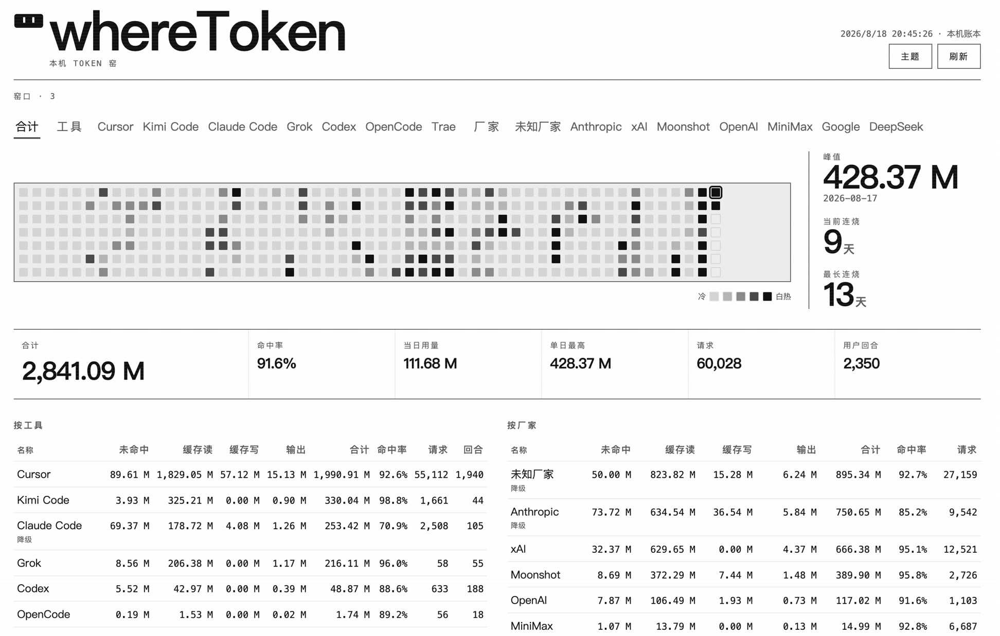
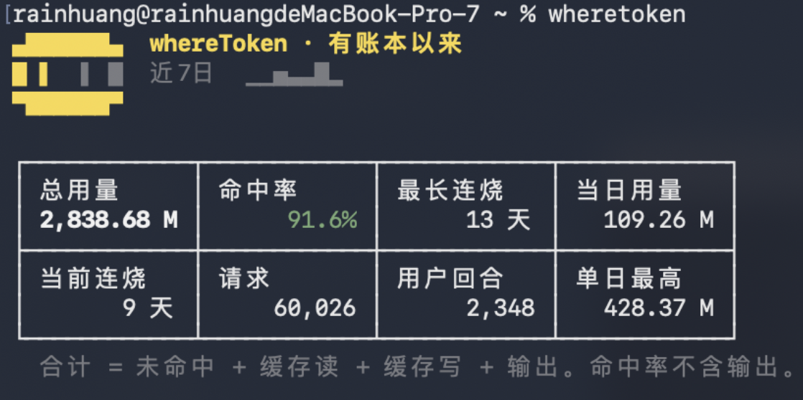
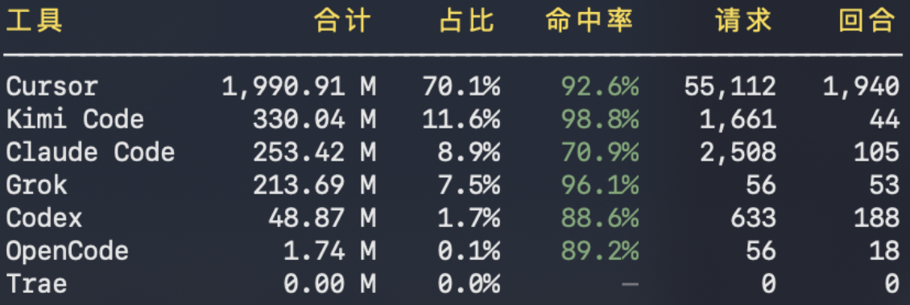
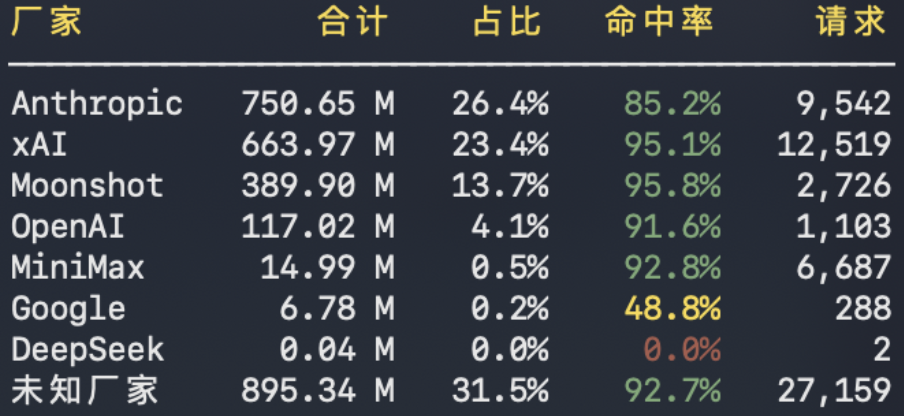
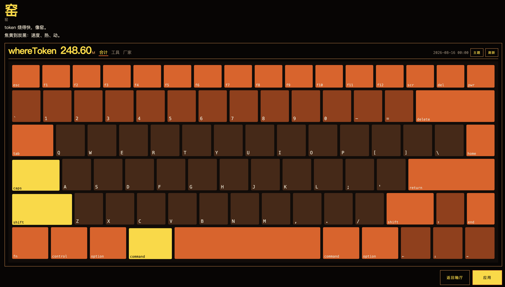

<p align="center">
  
</p>

<h1 align="center">whereToken</h1>

<p align="center">
  <b>Local-first token usage analytics for coding agents.</b>
</p>

<p align="center">
  Track token usage across Claude Code, Kimi Code, Codex, Cursor,<br>
  OpenCode, Grok CLI, Trae, and other supported tools.
</p>

<p align="center">
  <a href="./README.md"><b>English</b></a> ·
  <a href="./README.zh-CN.md">简体中文</a>
</p>

<p align="center">
  
  <a href="https://github.com/rainhuang0220/whereToken/releases"></a>
  <a href="https://github.com/rainhuang0220/whereToken/actions/workflows/ci.yml"></a>
  <a href="./LICENSE"></a>
  <a href="https://go.dev/"></a>
</p>

<p align="center">
  
</p>

<p align="center">
  <sub><b>墨</b> is the monochrome, newspaper-style theme.</sub>
</p>

Modern developers often use several coding agents at once. Each tool stores usage differently, so there is no single place to see where tokens went. whereToken discovers the data those agents already keep, normalizes it, and presents one view in the CLI, a local dashboard, and JSON.

It is designed to operate locally. Feedback and bug reports are welcome.

## Features

### Unified usage overview

View token usage from every supported coding agent that has data on this machine.

### Agent, provider, and model breakdown

See which application issued the request, which provider served the model, and which model was used.

### Historical usage

Inspect daily totals, streaks, and cache hit rate.

### Local dashboard

Explore the same data in a browser interface that runs on your machine.

### CLI and JSON

Query usage from the terminal, or export a normalized JSON report for scripts.

whereToken reports token counts. When a public list price exists, it also shows an API-equivalent estimate. That is not a subscription bill, and a missing price is not written as $0.

## Installation

### Recommended: Homebrew

```bash
brew tap rainhuang0220/wheretoken
brew install wheretoken
```

### Prebuilt binaries

macOS and Linux:

```bash
curl -fsSL https://raw.githubusercontent.com/rainhuang0220/whereToken/main/scripts/install.sh | bash
```

Windows (PowerShell):

```powershell
irm https://raw.githubusercontent.com/rainhuang0220/whereToken/main/scripts/install.ps1 | iex
```

Windows (Command Prompt, the `C:\Users\…>` window):

```bat
curl.exe -fsSL -o %TEMP%\wt-install.cmd https://raw.githubusercontent.com/rainhuang0220/whereToken/main/scripts/install.cmd && %TEMP%\wt-install.cmd
```

The script prints the installed path (`~/.local/bin/wheretoken` on Unix, `%LOCALAPPDATA%\whereToken\bin\wheretoken.exe` on Windows). Run that line. Open a new terminal if the command is not on `PATH` yet.

### Build from source

```bash
go install github.com/rainhuang0220/whereToken/cmd/wheretoken@latest
```

Release binaries and `brew tap` include the dashboard. `go install` and `brew --HEAD` build the CLI only. To serve the dashboard from a clone, build the web UI (`cd web && npm run build`) and set `WHERETOKEN_WEB` to `web/dist`.

The `npm/` wrapper is **not on the npm registry** yet.

## Quick start

```bash
wheretoken
```

<p align="center">
  
</p>

<table>
  <tr>
    <td width="50%" valign="top"></td>
    <td width="50%" valign="top"></td>
  </tr>
  <tr>
    <td align="center"><sub>By agent</sub></td>
    <td align="center"><sub>By provider</sub></td>
  </tr>
</table>

```bash
wheretoken --today
wheretoken --since 7d
wheretoken --json
wheretoken serve
wheretoken doctor
wheretoken rebuild
wheretoken update
wheretoken uninstall
```

`wheretoken doctor` explains which agents were found and whether their usage data is complete. `wheretoken rebuild` deletes the local scan cache and reads agent data again. Run `wheretoken --help` for the complete command reference.

## Dashboard

Start the local dashboard with:

```bash
wheretoken serve
```

The dashboard runs locally on your machine. It provides a visual overview of token usage across supported coding agents, providers, and models. Use the refresh control in the page to rescan; reloading the browser tab does not.

**窑** is whereToken's furnace mascot.

<p align="center">
  
</p>

## Supported coding agents

whereToken reads usage information from data made available by supported coding agents. Completeness varies by tool and may depend on whether the application is signed in.

| Coding agent | Usage data | Authentication |
|--------------|------------|----------------|
| Claude Code | Full | Not required |
| Kimi Code | Full | Not required |
| Codex | Full | Not required |
| OpenCode | Full | Not required |
| Grok CLI | Full | Not required |
| MiniMax Agent | Full | Not required |
| OpenClaw | Full | Not required |
| Cursor | Partial | Required for token columns |
| Trae / Trae CN / TRAE SOLO | Partial | Required |

Cursor and Trae must be **signed in** on this machine for token columns. Encrypted Trae storage is reported, not decrypted.

When a coding agent does not expose reliable usage information, whereToken reports the data as unavailable rather than treating it as zero. The dashboard labels each agent authoritative, degraded, estimated, or unavailable.

See [`docs/data-sources.md`](docs/data-sources.md) for how each agent is read and [`docs/token-accounting.md`](docs/token-accounting.md) for the normalized token model.

### Not currently supported

Windsurf, GitHub Copilot, Cline, and Lingma are not currently supported because whereToken does not yet have a reliable usage source for these tools.

## How it works

```text
Coding agents
      ↓
Local files and, for some agents, their own usage APIs
      ↓
Source-specific adapters
      ↓
Normalized usage data
      ↓
CLI / Dashboard / JSON
```

whereToken discovers usage information from supported coding agents, normalizes source-specific records into a common representation, and exposes the result through the CLI, dashboard, and JSON output. Later scans reuse a local file index as a cache only; `wheretoken rebuild` deletes that index and reads the agents again.

It distinguishes the **coding agent** you use from the **provider** that served the model.

A request made through Claude Code using a MiniMax model is reported as:

- **Agent:** Claude Code
- **Provider:** MiniMax

## Privacy & Security

### Local-first

whereToken is designed to operate locally and does not require a whereToken cloud service. Local-first remains the core.

### Data collection

Local analytics stay on this machine. Community Rank runs only when `WHERETOKEN_COMMUNITY_URL` is set; there is no public whereToken rank URL (a remote deploy blocker). When configured, it uploads **anonymous daily totals** only (participant UUID, local calendar day, token count, optional API-equivalent estimated cost, client version). A missing price is omitted, never sent as $0. It does not upload prompts, sessions, paths, request ids, credentials, raw events, or the SQLite index. Participation is on by default in that mode; `wheretoken community off`, `WHERETOKEN_COMMUNITY=0`, or `DO_NOT_TRACK=1` turns it off. Rank **累计** is the sum of days this client uploaded, not the kiln 全部 ledger. This is not a global, worldwide, or all-AI-users rank. See [`docs/community.md`](docs/community.md).

### Data sources

Usage information is read from data made available by supported coding agents. Most sources are local application data.

Cursor and Trae may access those applications' own APIs using credentials already stored by the corresponding application, to obtain token columns that are not present in the local files.

### Credentials

whereToken does not ask users to paste API keys into the application. When an integration requires authentication, it uses local data or credentials already managed by that application.

### Security policy

For security issues and the project's security policy, see [`SECURITY.md`](SECURITY.md). Do not include API keys, session tokens, or other secrets in bug reports.

## Limitations

whereToken is currently in **alpha**.

- Release binaries are currently **unsigned** ([`docs/macos-signing.md`](docs/macos-signing.md))
- An npm package is not currently published
- Some agents expose only partial usage information
- Some integrations require the corresponding application to be signed in
- The dashboard UI is currently Chinese-first

## Documentation

- CLI reference: [`docs/wheretoken.1`](docs/wheretoken.1)
- Data sources: [`docs/data-sources.md`](docs/data-sources.md)
- Token accounting: [`docs/token-accounting.md`](docs/token-accounting.md)
- Cost estimate: [`docs/cost.md`](docs/cost.md)
- Community Rank: [`docs/community.md`](docs/community.md)
- Adding an adapter: [`docs/adding-an-adapter.md`](docs/adding-an-adapter.md)
- JSON output format: [`docs/cli-json.schema.json`](docs/cli-json.schema.json)
- Completions: [`completions/`](completions/)
- Security policy: [`SECURITY.md`](SECURITY.md)
- Changelog: [`CHANGELOG.md`](CHANGELOG.md)

For the complete CLI reference, environment variables, exit codes, and JSON output format, see the project documentation.

## Development

```bash
go test ./...
make test
make ci
```

```bash
cd web && npm install && npm test && npm run build
go run ./cmd/wheretoken serve
```

## License

[MIT](LICENSE).
