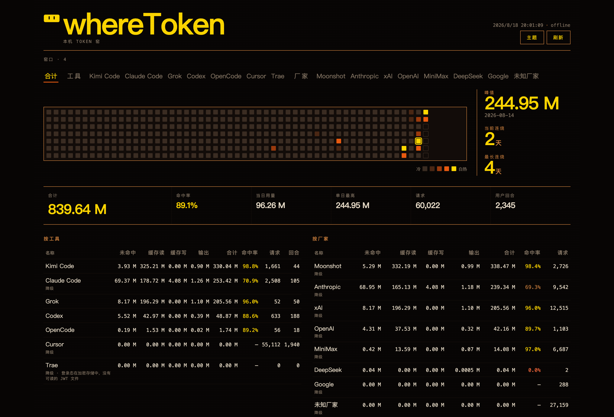

<p align="center">
  
</p>

<h1 align="center">whereToken</h1>

<p align="center">
  <b>See where your local coding-agent tokens went.</b><br>
  One command. A character table. A kiln dashboard if you want one.<br>
  No cloud account. No USD prices. No telemetry.
</p>

<p align="center">
  <b>English</b> · <a href="./README.zh-CN.md">简体中文</a>
</p>

<p align="center">
  <a href="#install">Install</a> ·
  <a href="#what-you-get">What you get</a> ·
  <a href="#dashboard">Dashboard</a> ·
  <a href="#what-it-reads">Sources</a> ·
  <a href="#privacy">Privacy</a>
</p>

<p align="center">
  <a href="https://github.com/rainhuang0220/whereToken/releases"></a>
  <a href="https://github.com/rainhuang0220/whereToken/actions/workflows/ci.yml"></a>
  <a href="./LICENSE"></a>
  <a href="https://go.dev/"></a>
  
</p>

<p align="center">
  
</p>

<p align="center"><sub>Real machine, 2026-08-18, <code>--offline</code>. Your numbers will differ. The table and dashboard speak Chinese today.</sub></p>

> **v0.3.0 is an Alpha.** Install it, run it on your own ledgers, [open an issue](https://github.com/rainhuang0220/whereToken/issues) when something is wrong or missing, and send pull requests. Ideas and failing ledgers both help.

## Why

You bounce between Claude Code, Cursor, Kimi, Grok, Codex, OpenCode, Trae. Each one has a corner of the story. Nobody adds the pile together.

whereToken reads the ledgers already on this machine and prints one table: **since records began**, in **millions of tokens (M)**. Cache hit rate, streaks, requests, user turns, then a ranking by **tool** and by **vendor**. Those two are not the same thing — Claude Code running MiniMax is still tool Claude Code, vendor MiniMax.

It does not price anything in USD. It does not phone home.

## What you get

- **Local only** — read-only files under your home. HTTP binds `127.0.0.1`.
- **A character table** — gold slab, eight KPIs, 7-day spark, rankings.
- **A kiln dashboard** — 53-week wall, drill-down, eight glazes.
- **Honest footnotes** — a signed-out Cursor is a note, not a fake `0.00 M` that looks unused.
- **Scriptable** — `--json` is [schema 1](docs/cli-json.schema.json).
- **Quiet about secrets** — JWTs, cookies, API keys never hit stdout.

```bash
wheretoken                 # everything since records began
wheretoken --today         # local timezone
wheretoken --cursor        # or --claude --kimi --grok --codex --opencode --trae
wheretoken --vendor=xai
wheretoken --model=k3
wheretoken serve           # kiln at http://127.0.0.1:8787
```

<p align="center">
  
</p>

<p align="center"><sub><code>wheretoken --today</code> — today only, then the model list that the all-time table hides.</sub></p>

## Install

macOS / Linux:

```bash
brew tap rainhuang0220/wheretoken
brew install wheretoken
```

```bash
curl -fsSL https://raw.githubusercontent.com/rainhuang0220/whereToken/main/scripts/install.sh | bash
```

Windows (PowerShell):

```powershell
irm https://raw.githubusercontent.com/rainhuang0220/whereToken/main/scripts/install.ps1 | iex
```

The curl / irm script prints the path it installed (usually `~/.local/bin/wheretoken`). Run that line. This shell will not see `wheretoken` until you open a new terminal. Archives are SHA-256 checked against `checksums.txt`.

Already have **Go 1.25+**?

```bash
go install github.com/rainhuang0220/whereToken/cmd/wheretoken@latest
```

From a clone, Homebrew can still build from source (needs Go):

```bash
brew install --HEAD ./Formula/wheretoken.rb
```

The kiln dashboard is embedded in **GitHub Release** binaries and `brew tap rainhuang0220/wheretoken`. `go install` and `brew --HEAD` embed a short HTML stub — from a clone, `cd web && npm run build`, then `WHERETOKEN_WEB=web/dist wheretoken serve`.

The `npm/` wrapper is **not on the npm registry** yet.

## Dashboard

```bash
wheretoken serve
```

Opens [http://127.0.0.1:8787](http://127.0.0.1:8787). **刷新** rescans disk (and signed-in Cursor / Trae). Reloading the tab does not.

<p align="center">
  
</p>

Eight glazes. Open **主题** and pick one. The dashboard does not load Google Fonts or any other third-party asset.

<p align="center">
  
</p>

## What it reads

Default scan only covers tools that already have a ledger on disk. macOS and Linux are first-class; Windows uses `%APPDATA%` the same way.

| Source | Tokens without signing in? |
|--------|----------------------------|
| Claude Code | Yes — `~/.claude/projects/**/*.jsonl` |
| Kimi Code | Yes — `~/.kimi-code/` |
| Grok CLI | Yes — `~/.grok/sessions/**/updates.jsonl` |
| Codex | Yes — `${CODEX_HOME:-~/.codex}/sessions/**/rollout-*.jsonl` |
| OpenCode | Yes — `$XDG_DATA_HOME/opencode` or `~/.local/share/opencode` |
| Cursor | Requests / turns from local bubbles. **Token columns need the app signed in.** |
| Trae / Trae CN / TRAE SOLO | **Yes, sign-in.** Encrypted `storage.json` is reported, not decrypted. |

Field mapping lives in [`docs/data-sources.md`](docs/data-sources.md). Not in this release: Windsurf, Copilot, Cline, Lingma, and similar, until there is a clear local token ledger.

`wheretoken scan --json` is the same payload the dashboard **刷新** uses. It is **not** schema 1, and it does not take `--today` / `--tool`.

<details>
<summary>More flags, env, exit codes</summary>

```bash
wheretoken --today --cursor
wheretoken --tool=claude
wheretoken --json              # schema 1 — docs/cli-json.schema.json
wheretoken --ascii             # old Windows consoles
wheretoken --width 40          # ranking drops 回合/请求 before names become C...
wheretoken --quiet             # no “正在读 …” on stderr
wheretoken --offline           # local ledgers only; skip Cursor/Trae APIs
wheretoken sources
wheretoken completion zsh      # also bash, fish, powershell
```

Checked-in scripts: [`completions/`](completions/). Manual page: [`docs/wheretoken.1`](docs/wheretoken.1).

```bash
wheretoken completion zsh > ~/.zfunc/_wheretoken   # then add ~/.zfunc to fpath
```

`--json` (schema 1) includes `period`, `total`, `total_m`, `hit_rate`, `requests`, `user_turns`, `tools`, `vendors`, `notes`. `--today` adds `models` and omits `last_7d` / streaks. `--model` sets `hide_turns: true` because turns are per-tool.

| Env | What it does |
|-----|----------------|
| `NO_COLOR` | no ANSI (same as `--no-color`) |
| `FORCE_COLOR` | ANSI even when stdout is not a TTY (`NO_COLOR` still wins) |
| `WHERETOKEN_ASCII=1` / `NO_UTF8` | ASCII box drawing |
| `WHERETOKEN_HOME` / `--home` | fake a home for tests |
| `WHERETOKEN_OFFLINE=1` | same as `--offline` |
| `WHERETOKEN_EXTRA_ROOTS` | extra homes (`:` on Unix, `;` on Windows; commas also work) |
| `WHERETOKEN_WEB` | directory of a built `web/dist` for `serve` |
| `CODEX_HOME` | Codex also reads this |
| `COLUMNS` | cap ranking width (same as `--width`) |

Exit codes: `0` ok (including zero data or a degraded login), `1` runtime failure, `2` usage (unknown command / tool / vendor / model).

</details>

## Privacy

Read-only local ledgers. `serve` binds `127.0.0.1` only and refuses a foreign `Host` / `Origin` / `Referer`. No telemetry. The dashboard does not load third-party fonts. The CLI never prints JWTs, access tokens, API keys, or cookies. Do not paste secrets into issues. See [`SECURITY.md`](SECURITY.md).

## Not yet

Short list, not a roadmap:

- GitHub Release binaries are **unsigned** until Apple signing secrets are set ([`docs/macos-signing.md`](docs/macos-signing.md)).
- There is **no npm package**.
- Trae and Cursor **token columns** need those apps **signed in** on this machine. Local Claude / Kimi / Grok / Codex / OpenCode ledgers do not.

## Develop

```bash
go test ./...
make test                          # go + web + npm wrapper
make ci                            # fmt-check + vet + test + race + fixture CLI
bash scripts/verify-cli.sh         # table against testdata, not $HOME
bash scripts/verify-local.sh       # optional: this machine's ledgers
cd web && npm install && npm test && npm run build
go run ./cmd/wheretoken serve
```

`go test` / `go install` use the **Go 1.25.13** toolchain from `go.mod` (Go 1.25.0+ will download it). From a clone, `go run` uses `./web/dist` only when `go.mod` is this module.

CI runs on GitHub Actions (Ubuntu, macOS, Windows). The same YAML is kept in [`ci/github-workflows/`](ci/github-workflows/).

## License

[MIT](LICENSE). Copyright (c) 2026 rainhuang0220.
